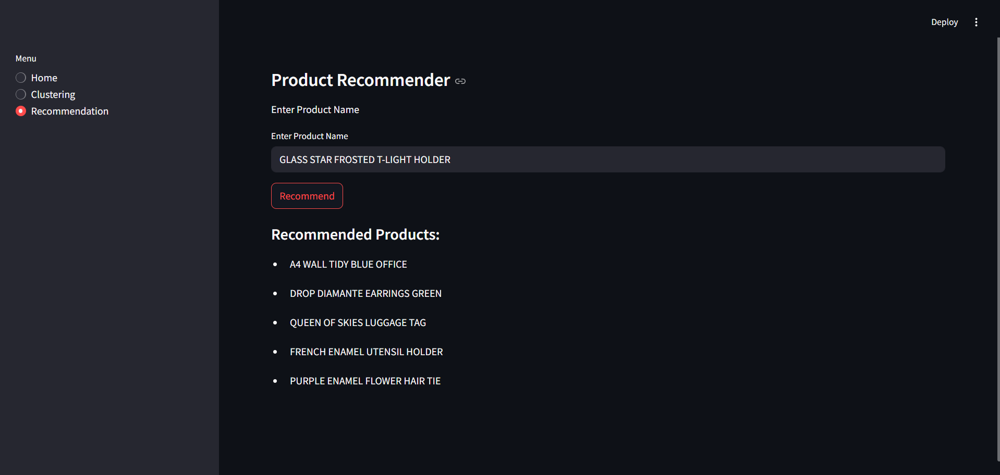

# Shopper Spectrum
A customer segmentation and product recommendation system built using Streamlit, pandas, and scikit-learn.

## Project Overview
This application provides two main features:

- **Customer Clustering:** Uses RFM (Recency, Frequency, Monetary) feature engineering and KMeans clustering to segment users.
- **Product Recommendations:** Based on item similarity using cosine similarity between customer-product interaction matrix.

## How It Works
- Preprocess transactional data to build an RFM table.
- Normalize RFM features and perform KMeans clustering.
- Generate item similarity matrix based on customer purchase patterns.
- Use Google Drive to host large `.pkl` file (item similarity matrix).
- App dynamically downloads model file and maps user-entered product names to stock codes for similarity lookup.

## Dependencies
Make sure the following are included in `requirements.txt`:

```
streamlit
pandas
scikit-learn
gdown
```

## RFM Feature Engineering
RFM stands for:
- **Recency**: How recently a customer made a purchase.
- **Frequency**: How often a customer makes a purchase.
- **Monetary**: How much money the customer spends.

These features are used to cluster customers into segments.

## Product Recommendation Logic
- Create a customer-item matrix based on quantities purchased.
- Compute cosine similarity between items.
- Recommend top N similar products for a selected item.

## Output Screenshot



## Streamlit App Link
<https://shopper-spectrum-iqvaeenk7ouxckcs3vbnru.streamlit.app/>
